# Procesverslag
Markdown is een simpele manier om HTML te schrijven.  
Markdown cheat cheet: [Hulp bij het schrijven van Markdown](https://github.com/adam-p/markdown-here/wiki/Markdown-Cheatsheet).

Nb. De standaardstructuur en de spartaanse opmaak van de README.md zijn helemaal prima. Het gaat om de inhoud van je procesverslag. Besteedt de tijd voor pracht en praal aan je website.

Nb. Door *open* toe te voegen aan een *details* element kun je deze standaard open zetten. Fijn om dat steeds voor de relevante stuk(ken) te doen.

## Jij

  
uitwerken voor kick-off werkgroep

  ### Auteur:
  Siu Han Ng

  #### Je startniveau:
  blauw

  #### Je focus:
  Beetje van beide (static&responsive)
 

## Je website

  
uitwerken voor kick-off werkgroep

  ### Je opdracht:
  https://oedipus.com/

  #### Screenshot(s) van de eerste pagina (small screen): 
  Homepage en de footer van de Oedipus website
  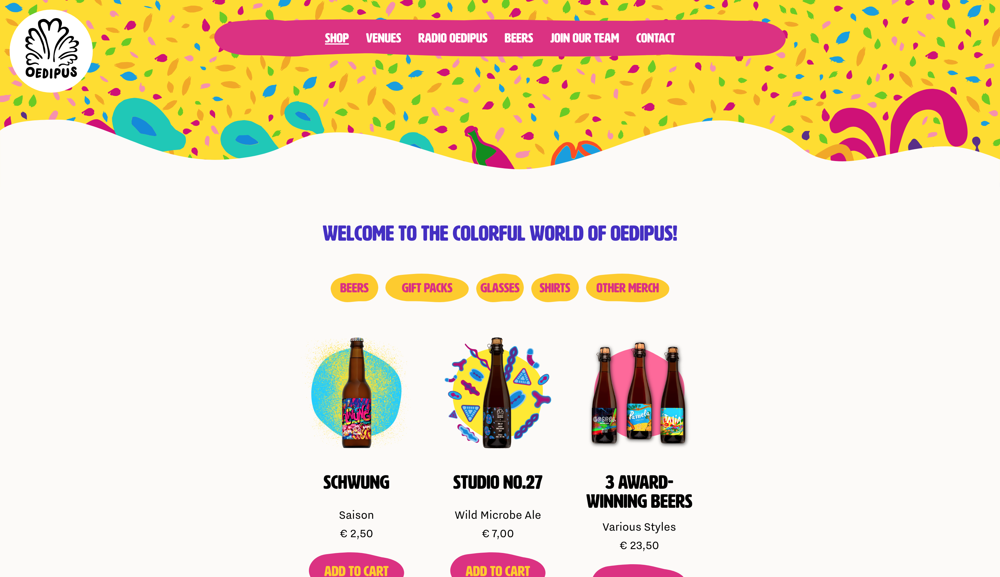
  
  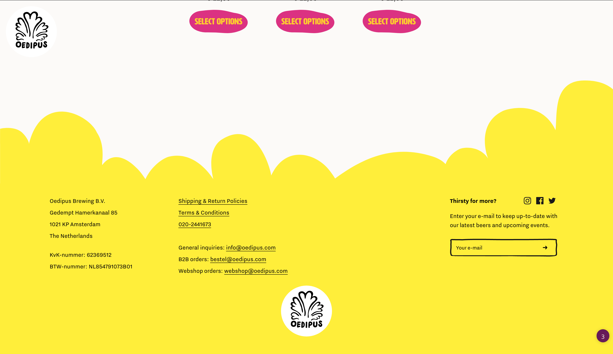

  #### Screenshot(s) van de tweede pagina (small screen):
  De tweede pagina van de Oedipus pagina (Beers)
  
  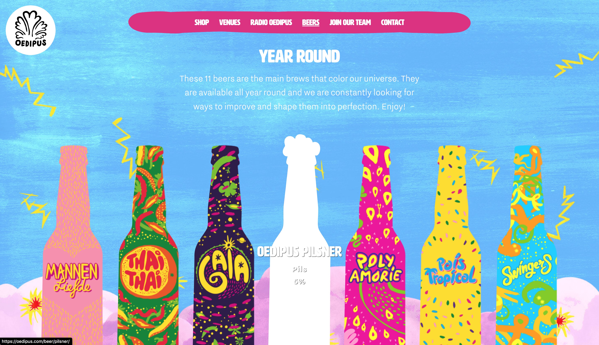

 

## Toegankelijkheidstest 1/2 (week 1)

  
uitwerken na test in 1e werkgroep

  ### Bevindingen
  Lijst met je bevindingen die in de test naar voren kwamen:

  #### Screenreader
  Dit was de eerste keer dat ik de screenreader gebruikte op de Mac. Het duurt wat langer to alle tekst is voorgelezen. Met de pijltjes en TAB kon ik wel makkelijk navigeren. Het zou erg lastig zijn als je niets ziet en wat wilt bestellen.  

  #### Muis en Toetsenbord 
  met de touchscreen is het wel makkelijk te besturen. Maar met toetsenbord en muis kan ik over de items hoveren voor meer informatie.
  
  Hier een omschrijving van hoe het opgelost kan worden (met indien nodig afbeeldingen)

  #### Motoriek (shocks, elastiekjes)
  Spasmes / parkingson:
Apparaat met schrokken: kan niet drukken op mijn toetsen op laptop, muispad verschuift heletijd en kan eigenlijk niet drukken op wat je wilt drukken. Kan niet focussen op de taak die je wilt doen, alleen op de schokken

  Elastiek: Het duurt wat langer om te typen, moet er aan wennen. Moet er aan denken om je middelvinger te gebruiken maar niet je vinger. Pagina srollt vanzelf omdat ik 2 vingers tegelijk de mousepad met 2 vingers aanraak. Ook de pagina gaat front en backwards

  #### Visueel (brillen, contrast, kleurenblind, dark/light). 
  Bril met witte vlekken:  iets minder zicht, maar wel leesbaar.
Bril met gele filter:   alles heeft een gele tint, witte kleuren zijn geel, en witte tekst is minder leesbaar op een pagina met veel kleur.

## Breakdownschets (week 1)

  
uitwerken na afloop 2e werkgroep

  ### de hele pagina: 
  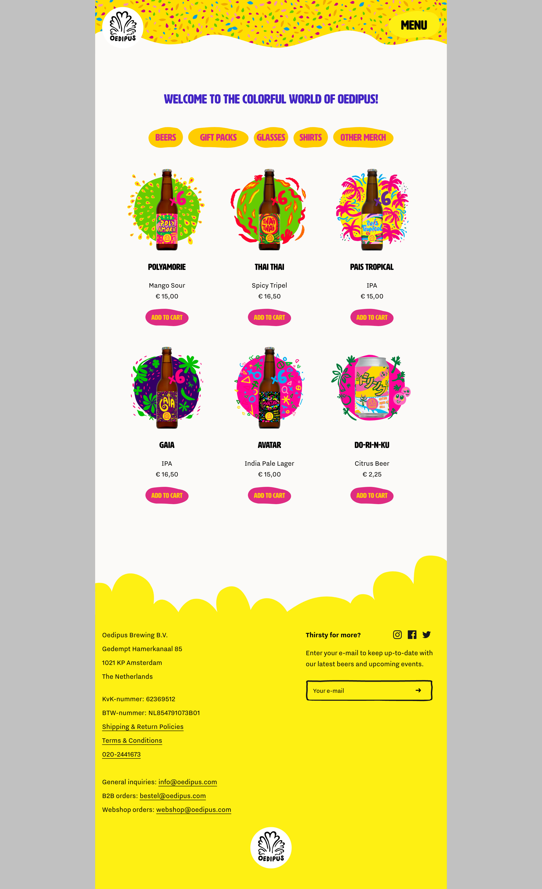
  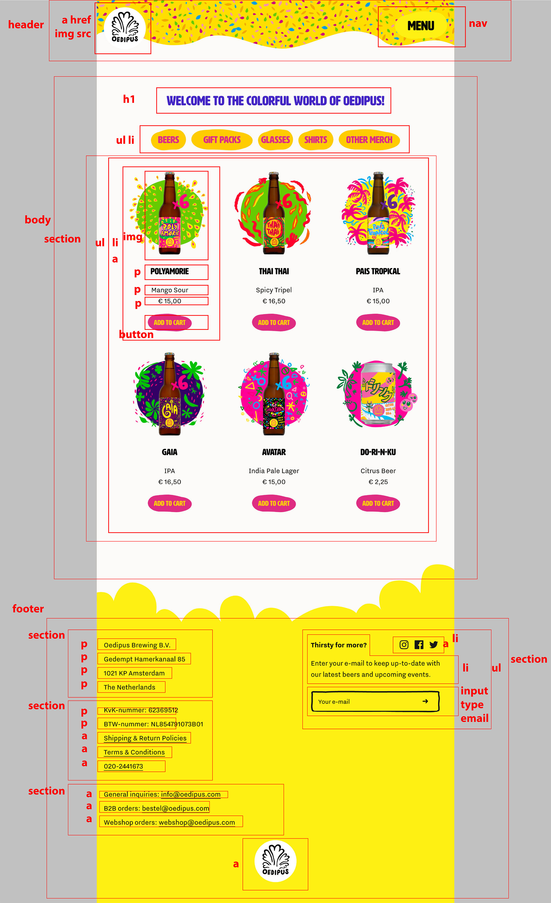

  ### dynamisch deel (bijv menu): 
  

  ### wellicht nog een dynamisch deel (bijv filter): 
  

## Voortgang 1 (week 2)

  
uitwerken voor 1e voortgang

  ### Stand van zaken
  hier ging goed & dit was lastig 
  
  
  Header > golfje kon ik niet oplossen
  Oplossing: photoshop
  
  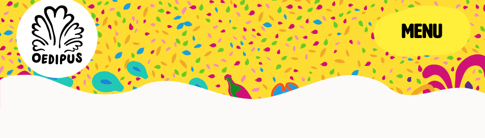
  
  Navigatie achtergrond hebben een golfje van een SVG, dat kan ik nog niet nu, dus zal het moeten kopieren of dieper researchen
  
  
  Heb nog struggles met de footer> met de nth-of-type. Maar vorige keer lukte dat niet dus moet daar nog aan verder.

  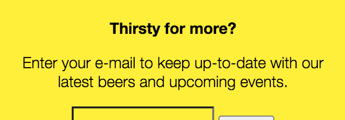
  
  HEt menu moet ik nog maken maar moet nog checken hoe dan moet:
  
  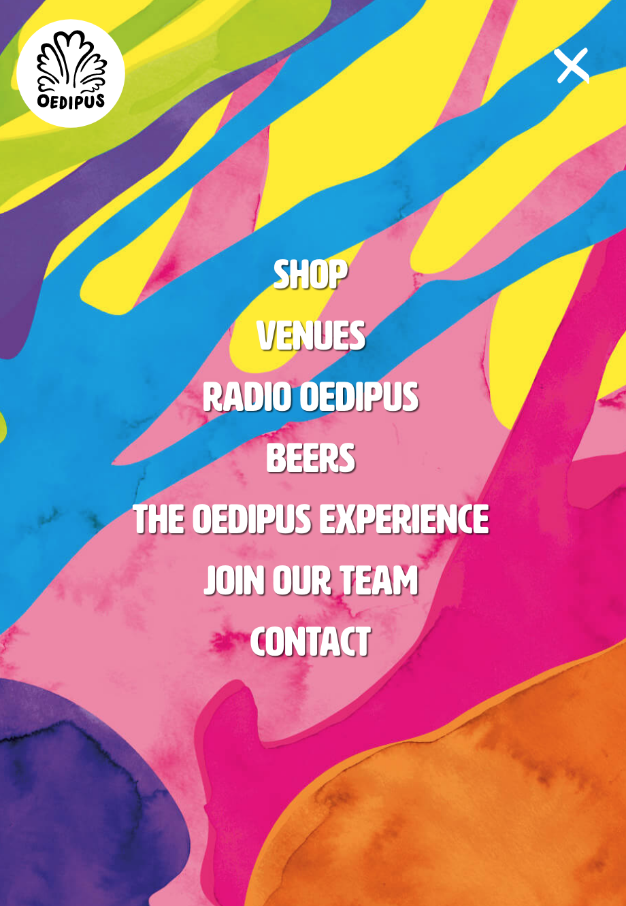
  
  ik weet nog niet hoe ik de achtergrond krom maak van de oranje effectjes
  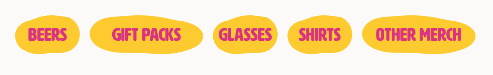

  ### Agenda voor meeting
  samen met je groepje opstellen

  | student 1      | student 2          | student 3    | student 4        |
  | ---            | ---                | ---          | ---              |
  | dit bespreken  | en dit             | en ik dit    | en dan ik dat    |
  | en dat ook nog | dit als er tijd is | nog een punt | dit wil ik zeker |
  | ...            | ...                | ...          | ...              |

  ### Verslag van meeting
  Met de volgende dingen had ik hulp gevraagd, Bram heeft mij geholpen met de volgende dingen:
  -display block van golf geel 
  -hover groter transform + animatie
  -text em > % procenten doen
  -prijs naast knopje > display flex
  -prijs/nav curly achtergrond is een image

## Voortgang 2 (week 3)

  
uitwerken voor 2e voortgang

  ### Stand van zaken
  hier dit ging goed & dit was lastig (neem ook screenshots op van delen van je website en code)

  ### Agenda voor meeting
  samen met je groepje opstellen

  | student 1      | student 2          | student 3    | student 4        |
  | ---            | ---                | ---          | ---              |
  | dit bespreken  | en dit             | en ik dit    | en dan ik dat    |
  | en dat ook nog | dit als er tijd is | nog een punt | dit wil ik zeker |
  | ...            | ...                | ...          | ...              |

  ### Verslag van meeting
  hier na afloop snel de uitkomsten van de meeting vastleggen

  - punt 1
  - punt 2
  - nog een punt
- ...

## Toegankelijkheidstest 2/2 (week 4)

  
uitwerken na test in 8e werkgroep

  ### Bevindingen
  Lijst met je bevindingen die in de test naar voren kwamen (geef ook aan wat er verbeterd is):

  #### Screenreader
  Hier korte omschrijving (met indien nodig afbeeldingen)

  Hier een omschrijving van hoe het opgelost kan worden (met indien nodig afbeeldingen)

  #### Muis en Toetsenbord 
  Hier korte omschrijving (met indien nodig afbeeldingen)

  Hier een omschrijving van hoe het opgelost kan worden (met indien nodig afbeeldingen)

  #### Motoriek (shocks, elastiekjes)
  Hier korte omschrijving (met indien nodig afbeeldingen)

  Hier een omschrijving van hoe het opgelost kan worden (met indien nodig afbeeldingen)

  #### Visueel (brillen, contrast, kleurenblind, dark/light). 
  Hier korte omschrijving (met indien nodig afbeeldingen)

  Hier een omschrijving van hoe het opgelost kan worden (met indien nodig afbeeldingen)

## Voortgang 3 (week 4)

  
uitwerken voor 3e voortgang

  ### Stand van zaken
  hier dit ging goed & dit was lastig (neem ook screenshots op van delen van je website en code)

  ### Agenda voor meeting
  samen met je groepje opstellen

  | student 1      | student 2          | student 3    | student 4        |
  | ---            | ---                | ---          | ---              |
  | dit bespreken  | en dit             | en ik dit    | en dan ik dat    |
  | en dat ook nog | dit als er tijd is | nog een punt | dit wil ik zeker |
  | ...            | ...                | ...          | ...              |

  ### Verslag van meeting
  hier na afloop snel de uitkomsten van de meeting vastleggen

  - punt 1
  - punt 2
  - nog een punt
  - ...

## Eindgesprek (week 5)

  
uitwerken voor eindgesprek

  ### Je uitkomst - karakteristiek screenshots:
  De website lijkt er nui echt goed op, en ben blij met het resultaat. Hierbij heb ik nog animaties en transities toegevoegd, waardoor het wat leuker is.
  

  ### Dit ging goed/Heb ik geleerd: 
  Ik heb vooral mijn kennis in css uitgebreid en JS vind ik nog moeilijk. Het lezen ervan begrijp ik wel, maar zelf schrijven is best lastig.

  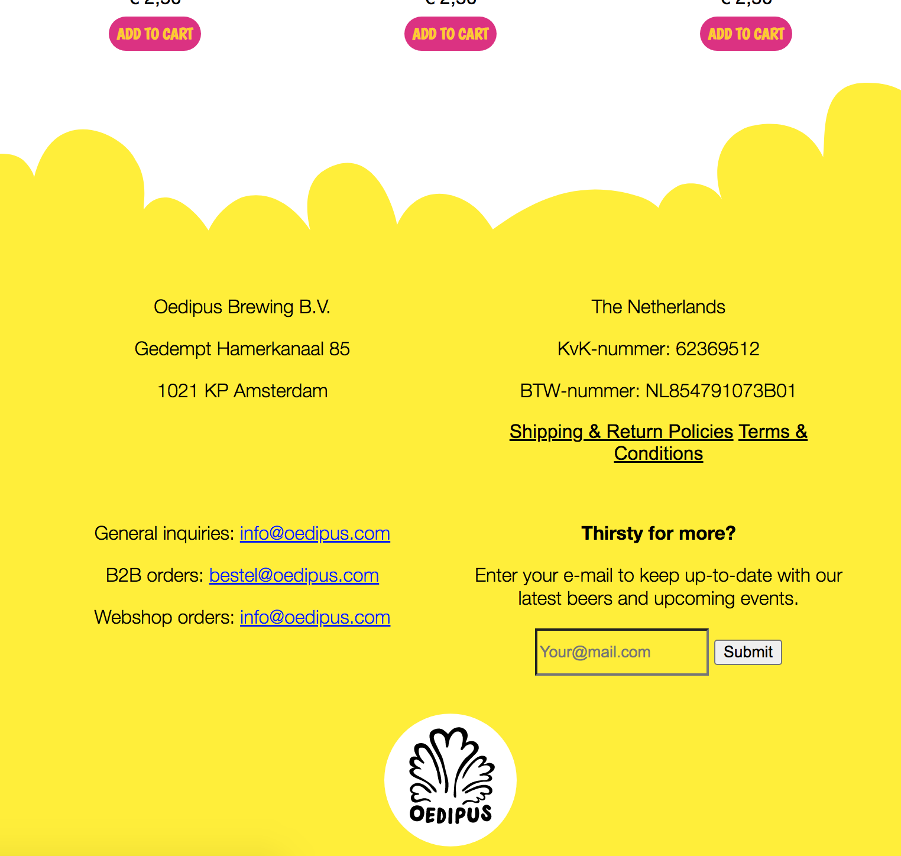
  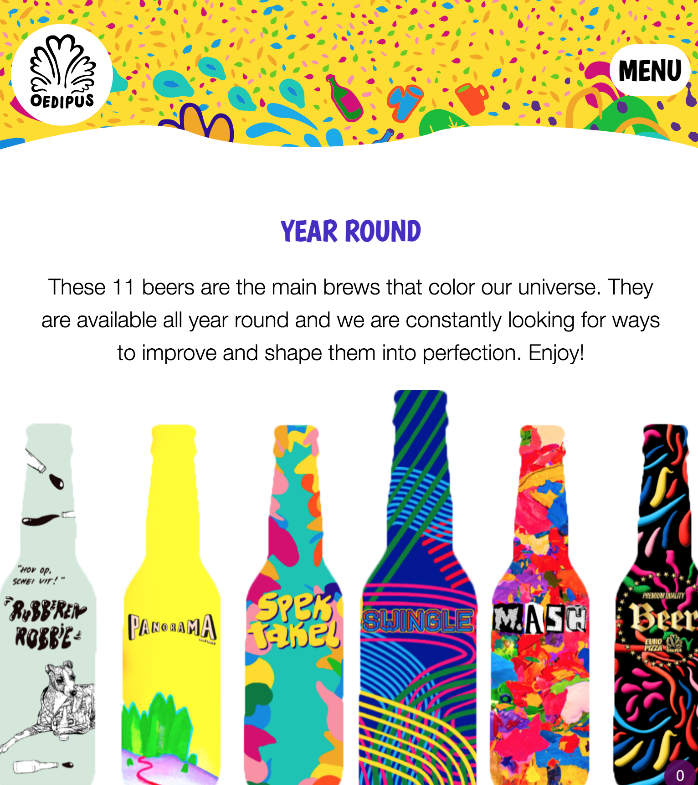

  ### Dit was lastig/Is niet gelukt:
  Foutjes zit in een kleine hoekje. Soms struggle ik met een code fout, maar blijkt gewoon een kleine tweak te zijn.
  Het is niet gelukt om de achtergrond van het menu mooi en kleurrijk te maken. Volgens mij heeft Oedipus dit met een soort vector gemaakt. Maar ik kan in de 'inspect element' dit niet vinden.
  
  Het zoekknopje vind ik niet zo mooi en heb daar niet zo veel moeite in gestoken. 

  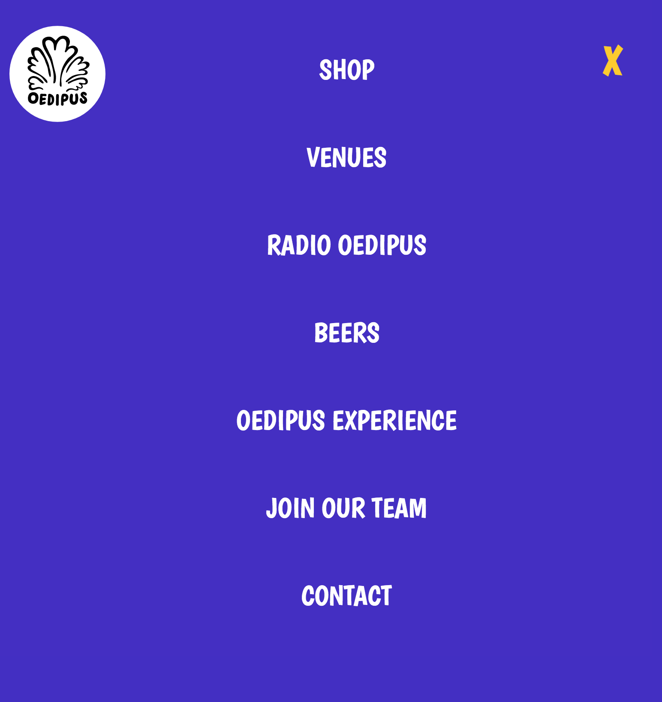

## Bronnenlijst

  
continu bijhouden terwijl je werkt

  Nb. Wees specifiek ('css-tricks' als bron is bijv. niet specifiek genoeg).

  - e-mail formulier input field: https://www.w3schools.com/tags/att_input_type_email.asp
  - achtergrond plaatje lokaal importeren: https://www.w3schools.com/cssref/pr_background-image.asp
  - HTML5 Element Flowchart: http://html5doctor.com/downloads/h5d-sectioning-flowchart.pdf
  - selector code https://www.w3schools.com/cssref/sel_focus.asp
  - scrollbare menu https://www.w3schools.com/howto/tryit.asp?filename=tryhow_css_menu_hor_scroll
  - centreren van tekstje https://www.w3.org/Style/Examples/007/center.nl.html
  - code voor ronde borders op een img https://www.w3schools.com/howto/howto_css_rounded_images.asp
  - Javascript: vanuit de werkgroep PDF van de JS les

